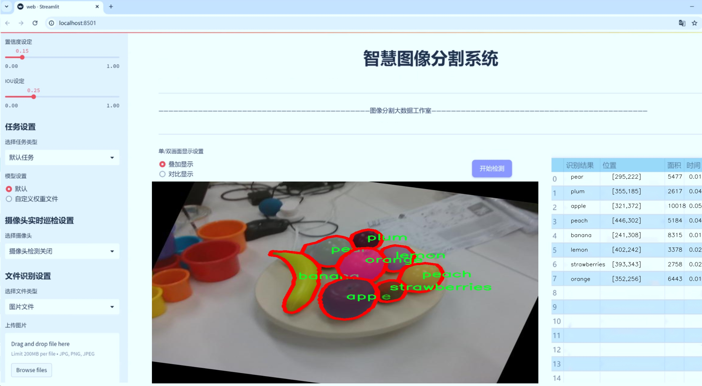
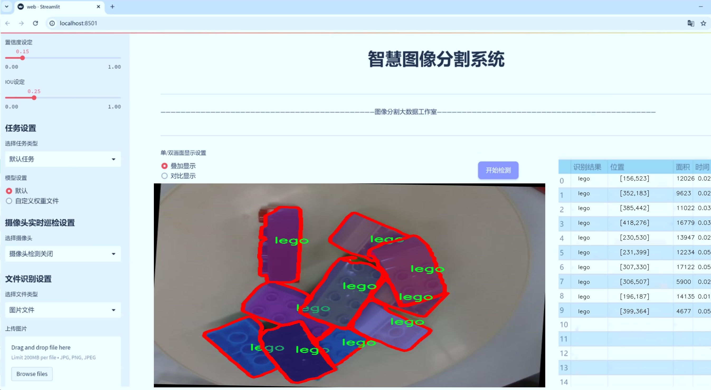
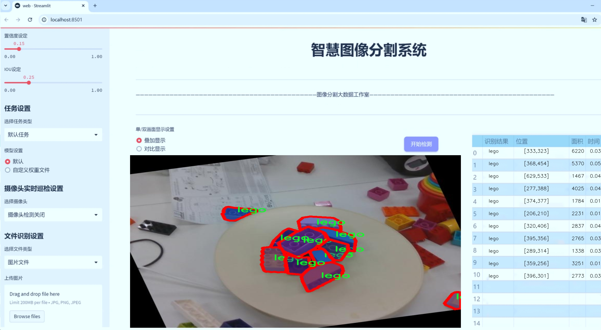
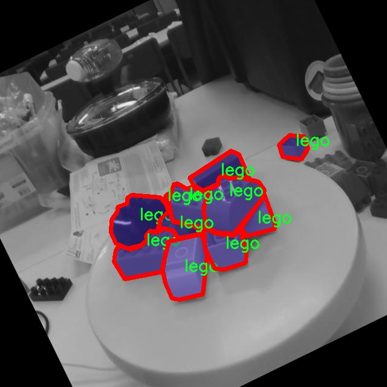
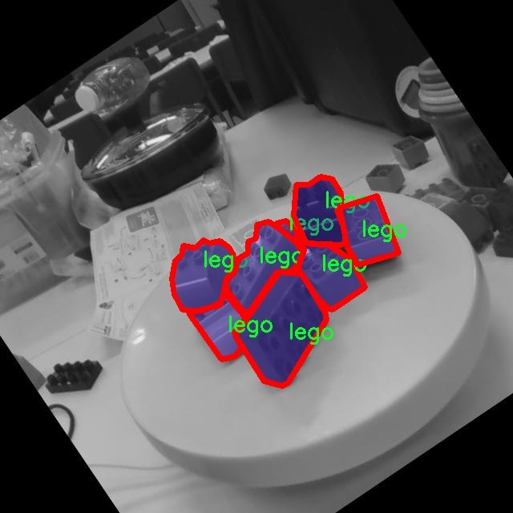
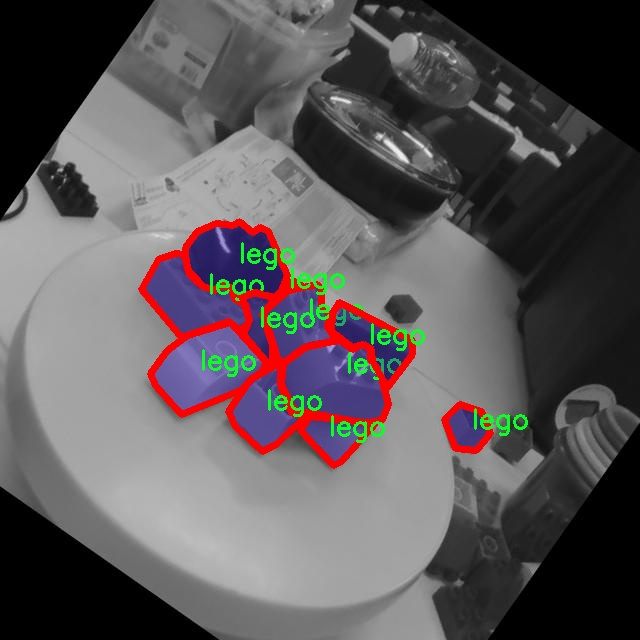
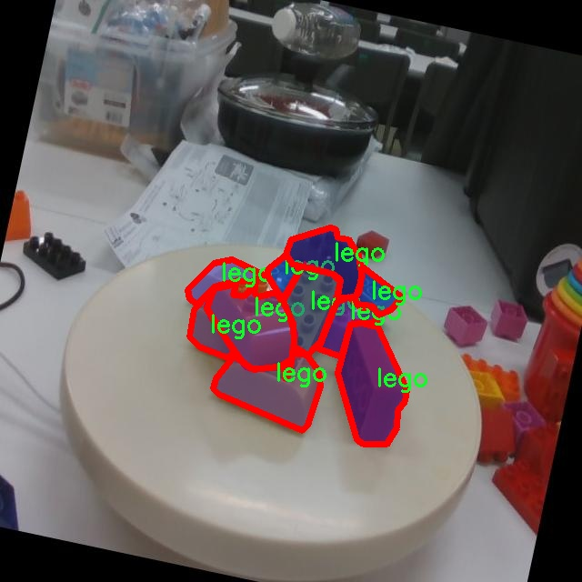
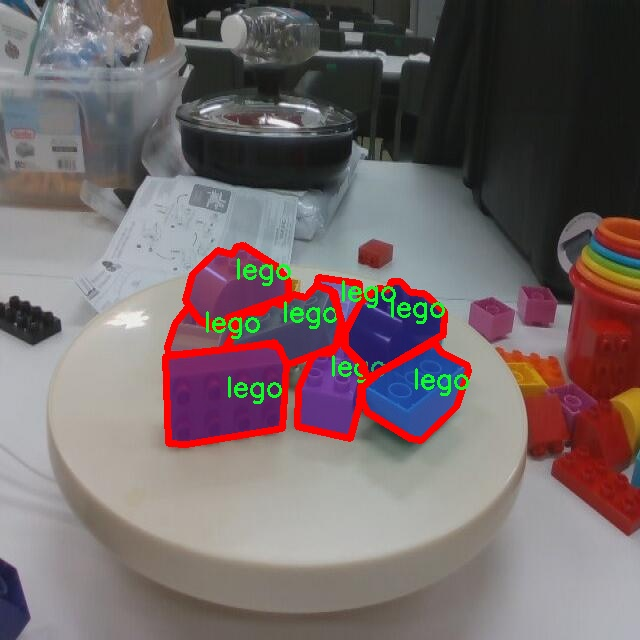

# 日常物品实例分割系统源码＆数据集分享
 [yolov8-seg-dyhead-DCNV3＆yolov8-seg-SPPF-LSKA等50+全套改进创新点发刊_一键训练教程_Web前端展示]

### 1.研究背景与意义

项目参考[ILSVRC ImageNet Large Scale Visual Recognition Challenge](https://gitee.com/YOLOv8_YOLOv11_Segmentation_Studio/projects)

项目来源[AAAI Global Al lnnovation Contest](https://kdocs.cn/l/cszuIiCKVNis)

研究背景与意义

随着人工智能技术的迅猛发展，计算机视觉领域的研究逐渐成为热点，其中实例分割技术在物体识别、场景理解和人机交互等应用中发挥着重要作用。实例分割不仅需要识别图像中的物体类别，还需精确地分割出每个物体的轮廓，这对于实现智能家居、自动驾驶、机器人操作等场景至关重要。近年来，YOLO（You Only Look Once）系列模型因其高效的实时检测能力而受到广泛关注。YOLOv8作为该系列的最新版本，在精度和速度上均有显著提升，为实例分割任务提供了更为强大的技术支持。

本研究旨在基于改进的YOLOv8模型，构建一个高效的日常物品实例分割系统。我们所使用的数据集“YCB_retry”包含3500张图像，涵盖54个类别的日常物品。这些物品包括常见的水果、餐具、清洁用品等，具有较强的实际应用价值。通过对这些物品进行实例分割，不仅可以提升计算机对日常生活场景的理解能力，还能为智能家居、自动化仓储等领域提供技术支持。

在现有的实例分割研究中，虽然已有多个模型取得了良好的效果，但在处理复杂背景、物体重叠和光照变化等问题时，仍然存在一定的局限性。通过对YOLOv8进行改进，我们希望能够增强其在复杂场景下的鲁棒性，提高分割精度。同时，考虑到实时性的重要性，改进后的模型将致力于在保证高精度的同时，提升处理速度，以满足实际应用需求。

此外，日常物品的实例分割不仅对技术发展具有推动作用，也为社会带来了深远的影响。随着智能设备的普及，用户对物体识别和分割的需求日益增加。通过实现高效的实例分割系统，可以在智能家居中实现物品的自动识别与管理，提高生活便利性。在医疗、安防等领域，精准的物体识别与分割技术也能够提升工作效率和安全性。

综上所述，本研究基于改进YOLOv8的日常物品实例分割系统，不仅具有重要的学术价值，也具备广泛的应用前景。通过深入探讨实例分割技术的优化与应用，我们期望能够为计算机视觉领域的发展贡献新的思路和方法，同时推动相关行业的智能化进程。

### 2.图片演示







##### 注意：由于此博客编辑较早，上面“2.图片演示”和“3.视频演示”展示的系统图片或者视频可能为老版本，新版本在老版本的基础上升级如下：（实际效果以升级的新版本为准）

  （1）适配了YOLOV8的“目标检测”模型和“实例分割”模型，通过加载相应的权重（.pt）文件即可自适应加载模型。

  （2）支持“图片识别”、“视频识别”、“摄像头实时识别”三种识别模式。

  （3）支持“图片识别”、“视频识别”、“摄像头实时识别”三种识别结果保存导出，解决手动导出（容易卡顿出现爆内存）存在的问题，识别完自动保存结果并导出到tempDir中。

  （4）支持Web前端系统中的标题、背景图等自定义修改，后面提供修改教程。

  另外本项目提供训练的数据集和训练教程,暂不提供权重文件（best.pt）,需要您按照教程进行训练后实现图片演示和Web前端界面演示的效果。

### 3.视频演示

[3.1 视频演示](https://www.bilibili.com/video/BV1AD2nYpEZB/)

### 4.数据集信息展示

##### 4.1 本项目数据集详细数据（类别数＆类别名）

nc: 55
names: ['9_hole', 'apple', 'banana', 'base_ball', 'box_of_sugar', 'brick', 'chain', 'chips', 'chocolate_pudding', 'clamp', 'cleanser', 'cleanser-', 'coffee', 'cracker_box', 'dice', 'flat_screw', 'fork', 'gelatin_box', 'glass_cleaner', 'golf_ball', 'hammer', 'knife', 'lego', 'lemon', 'meat_can', 'metal_bowl', 'mug', 'mustard', 'orange', 'padlock', 'peach', 'pear', 'pen', 'plastic_bolt', 'plum', 'plus_screw', 'racquet_ball', 'rope', 'rubick_cube', 'scissors', 'soccer_ball', 'soft_ball', 'soup_can', 'spatula', 'sponge', 'spoon', 'stacking_blocks', 'strawberries', 't-shirt', 'tennis_ball', 'timer', 'tuna_can', 'wine_glass', 'wood_block', 'wrench']


##### 4.2 本项目数据集信息介绍

数据集信息展示

在本研究中，我们使用了名为“YCB_retry”的数据集，以训练和改进YOLOv8-seg模型，旨在实现日常物品的实例分割。该数据集包含55个类别，涵盖了丰富多样的日常物品，这些物品不仅在日常生活中常见，而且在计算机视觉和机器人领域的应用中具有重要意义。通过对这些物品的实例分割，我们希望提高模型在实际应用中的识别精度和效率。

“YCB_retry”数据集的类别包括了从食品到工具的多种物品。例如，数据集中包含了多种水果，如苹果、香蕉、柠檬、桃子和梨等，这些水果不仅在视觉上具有鲜明的特征，而且在不同的光照和背景条件下也能展现出不同的表现。除此之外，数据集中还包括了各种日常生活中常用的物品，如清洁剂、咖啡、巧克力布丁、以及不同类型的罐头（如肉罐头和金枪鱼罐头），这些物品的多样性为模型的训练提供了丰富的样本。

在工具类物品方面，数据集同样涵盖了多种常见工具，如锤子、刀具、剪刀和扳手等。这些工具在形状、颜色和功能上各具特色，能够帮助模型学习到不同物体的几何特征和物理属性。此外，数据集中还包含了如乒乓球、足球、网球等运动器材，以及如乐高积木、拼图等玩具，这些物品的加入不仅丰富了数据集的多样性，也为模型的泛化能力提供了良好的基础。

为了确保模型能够在不同的环境中有效识别和分割这些物品，数据集中的图像涵盖了多种背景和光照条件。这样的设计使得模型在训练过程中能够学习到如何在复杂的场景中提取物体特征，从而提高其在实际应用中的鲁棒性和准确性。

在进行实例分割任务时，YOLOv8-seg模型将通过对“YCB_retry”数据集的学习，掌握每个类别物体的边界和形状特征。每个物体的实例分割不仅需要识别物体的类别，还需要准确地定位物体的轮廓，这对于实现精确的物体检测和分割至关重要。通过使用“YCB_retry”数据集，我们期望模型能够在处理复杂场景时，保持高效的分割性能，并在实际应用中展现出优越的表现。

综上所述，“YCB_retry”数据集为我们的研究提供了一个多样化且具有挑战性的训练基础。通过对55个类别的深入学习，YOLOv8-seg模型将能够更好地应对日常物品的实例分割任务，推动计算机视觉技术在智能家居、机器人操作等领域的应用进展。











### 5.全套项目环境部署视频教程（零基础手把手教学）

[5.1 环境部署教程链接（零基础手把手教学）](https://www.bilibili.com/video/BV1jG4Ve4E9t/?vd_source=bc9aec86d164b67a7004b996143742dc)


[5.2 安装Python虚拟环境创建和依赖库安装视频教程链接（零基础手把手教学）](https://www.bilibili.com/video/BV1nA4VeYEze/?vd_source=bc9aec86d164b67a7004b996143742dc)

### 6.手把手YOLOV8-seg训练视频教程（零基础小白有手就能学会）

[6.1 手把手YOLOV8-seg训练视频教程（零基础小白有手就能学会）](https://www.bilibili.com/video/BV1cA4VeYETe/?vd_source=bc9aec86d164b67a7004b996143742dc)


按照上面的训练视频教程链接加载项目提供的数据集，运行train.py即可开始训练



     Epoch   gpu_mem       box       obj       cls    labels  img_size
     1/200     0G   0.01576   0.01955  0.007536        22      1280: 100%|██████████| 849/849 [14:42<00:00,  1.04s/it]
               Class     Images     Labels          P          R     mAP@.5 mAP@.5:.95: 100%|██████████| 213/213 [01:14<00:00,  2.87it/s]
                 all       3395      17314      0.994      0.957      0.0957      0.0843

     Epoch   gpu_mem       box       obj       cls    labels  img_size
     2/200     0G   0.01578   0.01923  0.007006        22      1280: 100%|██████████| 849/849 [14:44<00:00,  1.04s/it]
               Class     Images     Labels          P          R     mAP@.5 mAP@.5:.95: 100%|██████████| 213/213 [01:12<00:00,  2.95it/s]
                 all       3395      17314      0.996      0.956      0.0957      0.0845

     Epoch   gpu_mem       box       obj       cls    labels  img_size
     3/200     0G   0.01561    0.0191  0.006895        27      1280: 100%|██████████| 849/849 [10:56<00:00,  1.29it/s]
               Class     Images     Labels          P          R     mAP@.5 mAP@.5:.95: 100%|███████   | 187/213 [00:52<00:00,  4.04it/s]
                 all       3395      17314      0.996      0.957      0.0957      0.0845


### 7.50+种全套YOLOV8-seg创新点代码加载调参视频教程（一键加载写好的改进模型的配置文件）

[7.1 50+种全套YOLOV8-seg创新点代码加载调参视频教程（一键加载写好的改进模型的配置文件）](https://www.bilibili.com/video/BV1Hw4VePEXv/?vd_source=bc9aec86d164b67a7004b996143742dc)

### 8.YOLOV8-seg图像分割算法原理

原始YOLOv8-seg算法原理

YOLOv8-seg算法是基于YOLOv8目标检测框架的一个重要扩展，旨在实现高效的图像分割任务。该算法继承了YOLO系列的设计理念，结合了目标检测和图像分割的优势，旨在提高在复杂场景下的目标识别和分割精度。YOLOv8-seg的核心架构依然围绕输入层、主干网络、特征融合层和解耦头进行构建，但在此基础上，增加了对分割任务的支持。

首先，YOLOv8-seg的输入层接收640x640的RGB图像，经过数据预处理后，进入主干网络。主干网络采用了CSPDarknet的思想，使用C2f模块替代了YOLOv5中的C3模块。C2f模块通过引入ELAN思想，增加了多个跳层连接，从而增强了特征提取的能力。这种设计不仅保持了模型的轻量化，还在梯度流动上提供了更丰富的信息，确保了在深层网络中梯度消失问题的缓解。

在特征融合层，YOLOv8-seg采用了PAN-FPN结构，这一结构通过自下而上的特征融合和自上而下的特征传递，充分利用了不同层次的特征信息。通过将高层特征与中层和浅层特征进行融合，YOLOv8-seg能够有效捕捉到目标的细节信息和语义信息。这种多尺度特征融合的策略，确保了在处理不同大小和形状的目标时，模型能够保持较高的准确性。

与传统的YOLO系列模型不同，YOLOv8-seg采用了Anchor-Free的设计理念，完全抛弃了以往的Anchor-Base方法。这一转变使得模型在处理复杂场景时，能够更加灵活地适应目标的多样性。通过将目标检测转化为关键点检测，YOLOv8-seg不仅简化了模型的结构，还提高了模型的泛化能力。这种方法避免了在训练之前对数据集进行复杂的聚类和参数设定，降低了计算复杂度。

在损失函数的设计上，YOLOv8-seg使用了VFLLoss作为分类损失，同时结合DFLLoss和CIoULoss来处理边界框回归。这种组合损失函数的设计，旨在提高模型在分类和定位任务上的表现。VFLLoss通过聚焦于难以分类的样本，增强了模型对小目标的识别能力，而DFLLoss则通过引入分布焦点损失，进一步提高了模型的定位精度。

样本匹配策略的创新也是YOLOv8-seg的一大亮点。YOLOv8-seg采用了Task-Aligned的Assigner匹配方式，替代了以往的静态匹配策略。这一新策略通过考虑任务的对齐程度，使得正负样本的选择更加合理，从而提升了模型的训练效率和最终的检测精度。

在图像分割的实现上，YOLOv8-seg通过解耦头结构将目标分类和边界框回归任务分开处理。解耦头的设计使得模型能够在处理分类任务时，更加专注于特征图中的类别信息，而在处理定位任务时，则更加关注边界框的精确位置。这种分离的策略有效提高了模型的收敛速度和预测精度，尤其是在复杂场景下的目标分割任务中。

YOLOv8-seg的网络框架图清晰地展示了其各个模块之间的关系和数据流动路径。输入图像经过主干网络的特征提取后，进入特征融合层进行多尺度特征的深度融合，最终通过解耦头输出分类和分割结果。该算法的设计充分考虑了实时性和准确性，适用于各种实际应用场景，如自动驾驶、安防监控和医学影像分析等。

总的来说，YOLOv8-seg算法在YOLO系列的基础上，通过引入新的模块和优化策略，极大地提升了目标检测和图像分割的性能。其灵活的结构设计和高效的特征融合能力，使得YOLOv8-seg在处理复杂场景时，能够保持较高的准确性和实时性，展现出良好的应用前景。随着对该算法的进一步研究和优化，预计将会在更多领域中得到广泛应用，推动计算机视觉技术的发展。


### 9.系统功能展示（检测对象为举例，实际内容以本项目数据集为准）

图9.1.系统支持检测结果表格显示

  图9.2.系统支持置信度和IOU阈值手动调节

  图9.3.系统支持自定义加载权重文件best.pt(需要你通过步骤5中训练获得)

  图9.4.系统支持摄像头实时识别

  图9.5.系统支持图片识别

  图9.6.系统支持视频识别

  图9.7.系统支持识别结果文件自动保存

  图9.8.系统支持Excel导出检测结果数据


### 10.50+种全套YOLOV8-seg创新点原理讲解（非科班也可以轻松写刊发刊，V11版本正在科研待更新）

#### 10.1 由于篇幅限制，每个创新点的具体原理讲解就不一一展开，具体见下列网址中的创新点对应子项目的技术原理博客网址【Blog】：


[10.1 50+种全套YOLOV8-seg创新点原理讲解链接](https://gitee.com/qunmasj/good)

#### 10.2 部分改进模块原理讲解(完整的改进原理见上图和技术博客链接)【此小节的图要是加载失败请移步原始博客查看，链接：https://blog.csdn.net/cheng2333333?type=blog】
### YOLOv8简介
#### Neck模块设计
骨干网络和 Neck 的具体变化为：

第一个卷积层的 kernel 从 6x6 变成了 3x3
所有的 C3 模块换成 C2f，结构如下所示，可以发现多了更多的跳层连接和额外的 Split 操作


去掉了 Neck 模块中的 2 个卷积连接层
Backbone 中 C2f 的 block 数从 3-6-9-3 改成了 3-6-6-3
查看 N/S/M/L/X 等不同大小模型，可以发现 N/S 和 L/X 两组模型只是改了缩放系数，但是 S/M/L 等骨干网络的通道数设置不一样，没有遵循同一套缩放系数。如此设计的原因应该是同一套缩放系数下的通道设置不是最优设计，YOLOv7 网络设计时也没有遵循一套缩放系数作用于所有模型。

#### Head模块设计
Head 部分变化最大，从原先的耦合头变成了解耦头，并且从 YOLOv5 的 Anchor-Based 变成了 Anchor-Free。其结构如下所示：


可以看出，不再有之前的 objectness 分支，只有解耦的分类和回归分支，并且其回归分支使用了 Distribution Focal Loss 中提出的积分形式表示法。

#### Loss 计算
Loss 计算过程包括 2 个部分： 正负样本分配策略和 Loss 计算。 现代目标检测器大部分都会在正负样本分配策略上面做文章，典型的如 YOLOX 的 simOTA、TOOD 的 TaskAlignedAssigner 和 RTMDet 的 DynamicSoftLabelAssigner，这类 Assigner 大都是动态分配策略，而 YOLOv5 采用的依然是静态分配策略。考虑到动态分配策略的优异性，YOLOv8 算法中则直接引用了 TOOD 的 TaskAlignedAssigner。 TaskAlignedAssigner 的匹配策略简单总结为： 根据分类与回归的分数加权的分数选择正样本。

s 是标注类别对应的预测分值，u 是预测框和 gt 框的 iou，两者相乘就可以衡量对齐程度。

对于每一个 GT，对所有的预测框基于 GT 类别对应分类分数，预测框与 GT 的 IoU 的加权得到一个关联分类以及回归的对齐分数 alignment_metrics 。
对于每一个 GT，直接基于 alignment_metrics 对齐分数选取 topK 大的作为正样本
Loss 计算包括 2 个分支： 分类和回归分支，没有了之前的 objectness 分支。
分类分支依然采用 BCE Loss
回归分支需要和 Distribution Focal Loss 中提出的积分形式表示法绑定，因此使用了 Distribution Focal Loss， 同时还使用了 CIoU Loss
Loss 采用一定权重比例加权即可。
#### 训练数据增强
数据增强方面和 YOLOv5 差距不大，只不过引入了 YOLOX 中提出的最后 10 个 epoch 关闭 Mosaic 的操作。假设训练 epoch 是 500，其示意图如下所示：

### RCS-OSA的基本原理
参考该博客，RCSOSA（RCS-One-Shot Aggregation）是RCS-YOLO中提出的一种结构，我们可以将主要原理概括如下：

1. RCS（Reparameterized Convolution based on channel Shuffle）: 结合了通道混洗，通过重参数化卷积来增强网络的特征提取能力。

2. RCS模块: 在训练阶段，利用多分支结构学习丰富的特征表示；在推理阶段，通过结构化重参数化简化为单一分支，减少内存消耗。

3. OSA（One-Shot Aggregation）: 一次性聚合多个特征级联，减少网络计算负担，提高计算效率。

4. 特征级联: RCS-OSA模块通过堆叠RCS，确保特征的复用并加强不同层之间的信息流动。

#### RCS
RCS（基于通道Shuffle的重参数化卷积）是RCS-YOLO的核心组成部分，旨在训练阶段通过多分支结构学习丰富的特征信息，并在推理阶段通过简化为单分支结构来减少内存消耗，实现快速推理。此外，RCS利用通道分割和通道Shuffle操作来降低计算复杂性，同时保持通道间的信息交换，这样在推理阶段相比普通的3×3卷积可以减少一半的计算复杂度。通过结构重参数化，RCS能够在训练阶段从输入特征中学习深层表示，并在推理阶段实现快速推理，同时减少内存消耗。

#### RCS模块
RCS（基于通道Shuffle的重参数化卷积）模块中，结构在训练阶段使用多个分支，包括1x1和3x3的卷积，以及一个直接的连接（Identity），用于学习丰富的特征表示。在推理阶段，结构被重参数化成一个单一的3x3卷积，以减少计算复杂性和内存消耗，同时保持训练阶段学到的特征表达能力。这与RCS的设计理念紧密相连，即在不牺牲性能的情况下提高计算效率。


上图为大家展示了RCS的结构，分为训练阶段（a部分）和推理阶段（b部分）。在训练阶段，输入通过通道分割，一部分输入经过RepVGG块，另一部分保持不变。然后通过1x1卷积和3x3卷积处理RepVGG块的输出，与另一部分输入进行通道Shuffle和连接。在推理阶段，原来的多分支结构被简化为一个单一的3x3 RepConv块。这种设计允许在训练时学习复杂特征，在推理时减少计算复杂度。黑色边框的矩形代表特定的模块操作，渐变色的矩形代表张量的特定特征，矩形的宽度代表张量的通道数。 

#### OSA
OSA（One-Shot Aggregation）是一个关键的模块，旨在提高网络在处理密集连接时的效率。OSA模块通过表示具有多个感受野的多样化特征，并在最后的特征映射中仅聚合一次所有特征，从而克服了DenseNet中密集连接的低效率问题。

OSA模块的使用有两个主要目的：

1. 提高特征表示的多样性：OSA通过聚合具有不同感受野的特征来增加网络对于不同尺度的敏感性，这有助于提升模型对不同大小目标的检测能力。

2. 提高效率：通过在网络的最后一部分只进行一次特征聚合，OSA减少了重复的特征计算和存储需求，从而提高了网络的计算和能源效率。

在RCS-YOLO中，OSA模块被进一步与RCS（基于通道Shuffle的重参数化卷积）相结合，形成RCS-OSA模块。这种结合不仅保持了低成本的内存消耗，而且还实现了语义信息的有效提取，对于构建轻量级和大规模的对象检测器尤为重要。

下面我将为大家展示RCS-OSA（One-Shot Aggregation of RCS）的结构。


在RCS-OSA模块中，输入被分为两部分，一部分直接通过，另一部分通过堆叠的RCS模块进行处理。处理后的特征和直接通过的特征在通道混洗（Channel Shuffle）后合并。这种结构设计用于增强模型的特征提取和利用效率，是RCS-YOLO架构中的一个关键组成部分旨在通过一次性聚合来提高模型处理特征的能力，同时保持计算效率。

#### 特征级联
特征级联（feature cascade）是一种技术，通过在网络的一次性聚合（one-shot aggregate）路径上维持有限数量的特征级联来实现的。在RCS-YOLO中，特别是在RCS-OSA（RCS-Based One-Shot Aggregation）模块中，只保留了三个特征级联。

特征级联的目的是为了减轻网络计算负担并降低内存占用。这种方法可以有效地聚合不同层次的特征，提高模型的语义信息提取能力，同时避免了过度复杂化网络结构所带来的低效率和高资源消耗。

下面为大家提供的图像展示的是RCS-YOLO的整体架构，其中包括RCS-OSA模块。RCS-OSA在模型中用于堆叠RCS模块，以确保特征的复用并加强不同层之间的信息流动。图中显示的多层RCS-OSA模块的排列和组合反映了它们如何一起工作以优化特征传递和提高检测性能。


总结：RCS-YOLO主要由RCS-OSA（蓝色模块）和RepVGG（橙色模块）构成。这里的n代表堆叠RCS模块的数量。n_cls代表检测到的对象中的类别数量。图中的IDetect是从YOLOv7中借鉴过来的，表示使用二维卷积神经网络的检测层。这个架构通过堆叠的RCS模块和RepVGG模块，以及两种类型的检测层，实现了对象检测的任务。 


### 11.项目核心源码讲解（再也不用担心看不懂代码逻辑）

#### 11.1 ultralytics\engine\predictor.py

以下是代码中最核心的部分，并附上详细的中文注释：

```python
class BasePredictor:
    """
    BasePredictor类用于创建预测器的基类。

    属性:
        args (SimpleNamespace): 预测器的配置。
        save_dir (Path): 保存结果的目录。
        model (nn.Module): 用于预测的模型。
        device (torch.device): 用于预测的设备。
        dataset (Dataset): 用于预测的数据集。
    """

    def __init__(self, cfg=DEFAULT_CFG, overrides=None, _callbacks=None):
        """
        初始化BasePredictor类。

        参数:
            cfg (str, optional): 配置文件的路径，默认为DEFAULT_CFG。
            overrides (dict, optional): 配置覆盖，默认为None。
        """
        self.args = get_cfg(cfg, overrides)  # 获取配置
        self.save_dir = get_save_dir(self.args)  # 获取保存目录
        self.done_warmup = False  # 是否完成预热
        self.model = None  # 模型初始化为None
        self.device = None  # 设备初始化为None
        self.dataset = None  # 数据集初始化为None
        self.callbacks = _callbacks or callbacks.get_default_callbacks()  # 获取回调函数

    def preprocess(self, im):
        """
        在推理之前准备输入图像。

        参数:
            im (torch.Tensor | List(np.ndarray)): 输入图像，可以是张量或图像列表。
        
        返回:
            torch.Tensor: 处理后的图像张量。
        """
        not_tensor = not isinstance(im, torch.Tensor)  # 检查输入是否为张量
        if not_tensor:
            im = np.stack(self.pre_transform(im))  # 预处理图像
            im = im[..., ::-1].transpose((0, 3, 1, 2))  # 转换为BCHW格式
            im = np.ascontiguousarray(im)  # 确保数组是连续的
            im = torch.from_numpy(im)  # 转换为张量

        im = im.to(self.device)  # 将图像移动到指定设备
        im = im.half() if self.model.fp16 else im.float()  # 转换为半精度或单精度
        if not_tensor:
            im /= 255  # 将像素值归一化到0.0 - 1.0
        return im

    def inference(self, im, *args, **kwargs):
        """对给定图像进行推理。"""
        return self.model(im, augment=self.args.augment)  # 使用模型进行推理

    def stream_inference(self, source=None, model=None, *args, **kwargs):
        """对摄像头实时流进行推理并将结果保存到文件。"""
        if not self.model:
            self.setup_model(model)  # 设置模型

        self.setup_source(source if source is not None else self.args.source)  # 设置数据源

        for batch in self.dataset:  # 遍历数据集
            path, im0s, vid_cap, s = batch  # 获取当前批次的路径、图像、视频捕获对象和状态
            im = self.preprocess(im0s)  # 预处理图像
            preds = self.inference(im, *args, **kwargs)  # 进行推理
            self.results = self.postprocess(preds, im, im0s)  # 后处理结果

            for i in range(len(im0s)):
                self.write_results(i, self.results, (path[i], im, im0s[i]))  # 写入结果

            yield from self.results  # 生成结果

    def setup_model(self, model, verbose=True):
        """初始化YOLO模型并设置为评估模式。"""
        self.model = AutoBackend(model or self.args.model, device=select_device(self.args.device, verbose=verbose))
        self.device = self.model.device  # 更新设备
        self.model.eval()  # 设置模型为评估模式

    def write_results(self, idx, results, batch):
        """将推理结果写入文件或目录。"""
        p, im, _ = batch  # 获取路径、图像和其他信息
        result = results[idx]  # 获取当前结果
        # 如果需要保存或显示结果，则进行处理
        if self.args.save or self.args.show:
            self.plotted_img = result.plot()  # 绘制结果图像
        if self.args.save_txt:
            result.save_txt(f'{self.save_dir}/labels/{p.stem}.txt')  # 保存文本结果
```

### 代码说明
1. **BasePredictor类**：这是一个基类，用于创建预测器，包含了初始化、预处理、推理、流推理、模型设置和结果写入等方法。
2. **预处理方法**：将输入图像转换为适合模型的格式，包括尺寸调整和数据类型转换。
3. **推理方法**：调用模型进行推理，返回预测结果。
4. **流推理方法**：处理实时视频流，进行推理并生成结果。
5. **模型设置方法**：初始化YOLO模型并设置为评估模式。
6. **结果写入方法**：将推理结果保存到指定路径或显示在窗口中。

通过这些核心部分，用户可以使用YOLO模型进行图像或视频的目标检测。

这个程序文件是一个用于进行目标检测的预测器，主要基于Ultralytics YOLO（You Only Look Once）模型。它支持在多种来源上进行预测，包括图像、视频、目录、流媒体等。程序的核心是`BasePredictor`类，该类提供了进行预测所需的基本功能。

在初始化时，`BasePredictor`类会加载配置文件，并设置一些基本参数，如置信度阈值、保存结果的目录等。它还会检查是否需要显示图像，并准备好模型和数据集。程序使用了一些实用工具来处理图像和模型的输入输出。

在图像预处理阶段，输入图像会被转换为适合模型输入的格式，包括调整图像大小和颜色通道的转换。随后，模型会对处理后的图像进行推理，得到预测结果。推理过程包括了前处理、模型推理和后处理三个步骤。

预测结果会被写入文件或目录，程序会根据配置决定是否保存预测结果、显示图像或保存裁剪的图像。它还提供了实时流媒体推理的功能，可以在摄像头输入上进行实时检测。

程序还实现了回调机制，允许用户在不同的预测阶段插入自定义功能，例如在开始预测、处理每个批次和结束预测时运行特定的代码。这使得程序具有很好的扩展性。

此外，程序支持多种模型格式的加载，包括PyTorch、ONNX、TensorRT等，用户可以根据需求选择合适的模型进行推理。总的来说，这个文件提供了一个灵活且功能强大的框架，用于在各种输入源上进行目标检测。

#### 11.2 ui.py

以下是经过简化并注释的核心代码部分：

```python
import sys
import subprocess

def run_script(script_path):
    """
    使用当前 Python 环境运行指定的脚本。

    Args:
        script_path (str): 要运行的脚本路径

    Returns:
        None
    """
    # 获取当前 Python 解释器的路径
    python_path = sys.executable

    # 构建运行命令，使用 streamlit 运行指定的脚本
    command = f'"{python_path}" -m streamlit run "{script_path}"'

    # 执行命令并等待其完成
    result = subprocess.run(command, shell=True)
    
    # 检查命令执行的返回码，如果不为0，则表示出错
    if result.returncode != 0:
        print("脚本运行出错。")

# 主程序入口
if __name__ == "__main__":
    # 指定要运行的脚本路径
    script_path = "web.py"  # 假设脚本在当前目录下

    # 调用函数运行脚本
    run_script(script_path)
```

### 代码注释说明：
1. **导入模块**：
   - `sys`：用于获取当前 Python 解释器的路径。
   - `subprocess`：用于执行外部命令。

2. **`run_script` 函数**：
   - 接收一个脚本路径作为参数，并使用当前 Python 环境运行该脚本。
   - 使用 `sys.executable` 获取当前 Python 解释器的路径。
   - 构建一个命令字符串，使用 `streamlit` 模块运行指定的脚本。
   - 使用 `subprocess.run` 执行命令，并等待其完成。
   - 检查命令的返回码，如果返回码不为0，表示脚本运行出错，并打印错误信息。

3. **主程序入口**：
   - 在脚本被直接运行时，指定要运行的脚本路径（这里假设为 `web.py`）。
   - 调用 `run_script` 函数来执行指定的脚本。

这个程序文件名为 `ui.py`，主要功能是使用当前的 Python 环境来运行一个指定的脚本。代码首先导入了必要的模块，包括 `sys`、`os` 和 `subprocess`，以及一个自定义的 `abs_path` 函数，这个函数可能用于获取文件的绝对路径。

在 `run_script` 函数中，程序接受一个参数 `script_path`，这是要运行的脚本的路径。函数内部首先获取当前 Python 解释器的路径，存储在 `python_path` 变量中。接着，构建一个命令字符串，使用 `streamlit` 模块来运行指定的脚本。这个命令会在命令行中执行。

随后，使用 `subprocess.run` 方法来执行构建好的命令。该方法的 `shell=True` 参数表示在一个新的 shell 中执行命令。执行后，程序会检查返回的结果，如果返回码不为零，说明脚本运行过程中出现了错误，此时会打印出“脚本运行出错。”的提示信息。

在文件的最后部分，使用 `if __name__ == "__main__":` 语句来确保只有在直接运行该脚本时才会执行以下代码。这里指定了要运行的脚本路径 `script_path`，通过调用 `abs_path` 函数获取 `web.py` 的绝对路径。最后，调用 `run_script` 函数来执行这个脚本。

整体来看，这个程序的目的是为了方便地在 Python 环境中运行一个 Streamlit 应用，简化了脚本的执行过程。

#### 11.3 train.py

以下是代码中最核心的部分，并附上详细的中文注释：

```python
import os
import torch
import yaml
from ultralytics import YOLO  # 导入YOLO模型

if __name__ == '__main__':  # 确保该模块被直接运行时才执行以下代码
    # 设置训练参数
    workers = 1  # 数据加载的工作进程数量
    batch = 8  # 每个批次的大小，需根据显存/内存情况调整
    device = "0" if torch.cuda.is_available() else "cpu"  # 检查是否有可用的GPU，选择设备

    # 获取数据集的yaml配置文件的绝对路径
    data_path = abs_path(f'datasets/data/data.yaml', path_type='current')

    # 读取YAML文件，保持原有顺序
    with open(data_path, 'r') as file:
        data = yaml.load(file, Loader=yaml.FullLoader)

    # 修改数据集中训练、验证和测试的路径
    if 'train' in data and 'val' in data and 'test' in data:
        directory_path = os.path.dirname(data_path.replace(os.sep, '/'))  # 获取目录路径
        data['train'] = directory_path + '/train'  # 更新训练数据路径
        data['val'] = directory_path + '/val'  # 更新验证数据路径
        data['test'] = directory_path + '/test'  # 更新测试数据路径

        # 将修改后的数据写回YAML文件
        with open(data_path, 'w') as file:
            yaml.safe_dump(data, file, sort_keys=False)

    # 加载YOLO模型，指定配置文件和预训练权重
    model = YOLO(r"C:\codeseg\codenew\50+种YOLOv8算法改进源码大全和调试加载训练教程（非必要）\改进YOLOv8模型配置文件\yolov8-seg-C2f-Faster.yaml").load("./weights/yolov8s-seg.pt")

    # 开始训练模型
    results = model.train(
        data=data_path,  # 指定训练数据的配置文件路径
        device=device,  # 指定训练设备
        workers=workers,  # 指定数据加载的工作进程数量
        imgsz=640,  # 指定输入图像的大小为640x640
        epochs=100,  # 指定训练100个epoch
        batch=batch,  # 指定每个批次的大小
    )
```

### 代码说明：
1. **导入必要的库**：引入了操作系统、PyTorch、YAML处理库和YOLO模型库。
2. **设置训练参数**：包括工作进程数量、批次大小和设备选择（GPU或CPU）。
3. **读取和修改YAML配置文件**：读取数据集的配置文件，更新训练、验证和测试数据的路径，并将修改后的内容写回文件。
4. **加载YOLO模型**：根据指定的配置文件和预训练权重加载YOLO模型。
5. **训练模型**：调用模型的训练方法，传入数据路径、设备、工作进程数量、图像大小、训练轮数和批次大小等参数。

该程序文件 `train.py` 是一个用于训练 YOLO 模型的脚本。首先，程序导入了必要的库，包括 `os`、`torch`、`yaml` 和 `ultralytics` 中的 YOLO 模型。它还导入了一个路径处理模块 `abs_path`，并设置了 Matplotlib 的后端为 `TkAgg`，以便在图形界面中显示。

在 `__main__` 块中，程序首先设置了一些训练参数，包括工作进程数 `workers` 和批次大小 `batch`。批次大小可以根据计算机的显存和内存进行调整，如果出现显存不足的情况，可以适当降低该值。接着，程序检查是否有可用的 GPU，如果有，则将设备设置为 `"0"`，否则使用 CPU。

接下来，程序通过 `abs_path` 函数获取数据集配置文件 `data.yaml` 的绝对路径，并将其转换为 UNIX 风格的路径。然后，程序获取该路径的目录，并打开 YAML 文件以读取数据。读取后，程序检查数据中是否包含 `train`、`val` 和 `test` 项，如果存在，则将这些项的路径修改为相对于目录的路径，并将修改后的数据写回 YAML 文件。

程序中有一段注释，提醒用户不同的模型对设备的要求不同，如果遇到错误，可以尝试使用其他模型进行测试。随后，程序加载了一个特定配置的 YOLO 模型，并从指定路径加载预训练的权重文件。

最后，程序调用 `model.train` 方法开始训练模型，传入了训练数据的配置文件路径、设备、工作进程数、输入图像大小、训练的 epoch 数量和批次大小等参数。这样，程序就可以开始训练 YOLO 模型，使用指定的数据集和配置进行训练。

#### 11.4 ultralytics\models\sam\modules\__init__.py

```python
# Ultralytics YOLO 🚀, AGPL-3.0 license

# 该代码是Ultralytics YOLO模型的基础部分，YOLO（You Only Look Once）是一种用于目标检测的深度学习模型。

# 这里的注释将重点解释YOLO模型的核心部分及其功能。

# 导入必要的库
import torch  # 导入PyTorch库，用于深度学习模型的构建和训练

# 定义YOLO模型类
class YOLO:
    def __init__(self, model_path):
        # 初始化YOLO模型
        self.model = self.load_model(model_path)  # 加载预训练模型

    def load_model(self, model_path):
        # 加载模型的函数
        return torch.load(model_path)  # 使用PyTorch加载模型

    def predict(self, image):
        # 进行目标检测的预测函数
        with torch.no_grad():  # 在推理时不需要计算梯度
            predictions = self.model(image)  # 使用模型对输入图像进行预测
        return predictions  # 返回预测结果

# 使用示例
if __name__ == "__main__":
    yolo_model = YOLO('path/to/model.pt')  # 创建YOLO模型实例并加载模型
    image = torch.zeros((1, 3, 640, 640))  # 创建一个示例输入图像（空白图像）
    results = yolo_model.predict(image)  # 对图像进行预测
    print(results)  # 输出预测结果
```

### 代码核心部分及注释说明：
1. **导入库**：导入了PyTorch库，这是实现YOLO模型所需的深度学习框架。
2. **YOLO类**：定义了一个YOLO类，包含模型的初始化、加载和预测功能。
   - `__init__`方法：用于初始化YOLO模型，加载指定路径的预训练模型。
   - `load_model`方法：负责从给定路径加载模型。
   - `predict`方法：用于对输入图像进行目标检测，返回模型的预测结果。
3. **使用示例**：在主程序中创建YOLO模型实例，加载模型，并对一个示例图像进行预测，最后输出结果。

这个文件是Ultralytics YOLO项目的一部分，具体位于`ultralytics/models/sam/modules/__init__.py`。文件开头的注释表明该项目使用的是AGPL-3.0许可证，这是一种开源许可证，允许用户自由使用、修改和分发软件，但要求在分发时也必须遵循相同的许可证条款。

在Python中，`__init__.py`文件的主要作用是将包含该文件的目录标识为一个包，使得可以通过导入该目录中的模块来使用其中的功能。虽然在你提供的代码片段中没有显示具体的实现内容，但通常情况下，这个文件可能会包含一些初始化代码，或者导入其他模块和类，以便在包被导入时能够方便地访问。

例如，这个文件可能会导入一些关键的类或函数，使得用户在导入`ultralytics.models.sam.modules`时，可以直接使用这些功能，而不需要逐个导入内部的模块。这种做法提高了代码的可用性和可读性。

总的来说，`__init__.py`文件在Python包中扮演着重要的角色，确保包的结构清晰，并提供了便捷的访问方式。

#### 11.5 ultralytics\models\__init__.py

以下是保留的核心代码部分，并附上详细的中文注释：

```python
# 导入所需的模块
from .rtdetr import RTDETR  # 导入RTDETR类
from .sam import SAM        # 导入SAM类
from .yolo import YOLO      # 导入YOLO类

# 定义可导出的模块列表
__all__ = 'YOLO', 'RTDETR', 'SAM'  # 允许简化导入，指定可以从此模块导入的类
```

### 注释说明：
1. **导入模块**：
   - `from .rtdetr import RTDETR`：从当前包中导入`RTDETR`类，通常用于目标检测任务。
   - `from .sam import SAM`：从当前包中导入`SAM`类，可能用于分割或其他相关任务。
   - `from .yolo import YOLO`：从当前包中导入`YOLO`类，YOLO（You Only Look Once）是一种流行的实时目标检测算法。

2. **可导出模块列表**：
   - `__all__`是一个特殊变量，用于定义当使用`from module import *`时，哪些名称会被导入。在这里，`YOLO`、`RTDETR`和`SAM`被列为可导出的类，使得用户在导入时可以直接使用这些类，而不需要知道它们的具体模块路径。

这个程序文件是一个Python模块的初始化文件，位于`ultralytics/models`目录下，文件名为`__init__.py`。它的主要功能是定义模块的公共接口，并允许其他模块或脚本以更简洁的方式导入其中的类或函数。

文件开头的注释部分表明这个项目是Ultralytics YOLO的实现，并且使用的是AGPL-3.0许可证，这意味着该代码是开源的，用户可以自由使用和修改，但需要遵循相应的许可证条款。

接下来，文件通过相对导入的方式引入了三个类：`RTDETR`、`SAM`和`YOLO`。这些类可能分别实现了不同的模型或算法，具体功能需要查看它们各自的实现文件。

最后，`__all__`变量被定义为一个包含字符串的元组，列出了可以被外部导入的公共类名。这意味着当其他模块使用`from ultralytics.models import *`的方式导入时，只会导入`YOLO`、`RTDETR`和`SAM`这三个类，而不会导入其他未列出的内容。这种做法有助于控制模块的可见性和避免命名冲突。

总体来说，这个文件的主要作用是组织和简化模块的导入，使得使用者能够方便地访问到模型相关的类。

#### 11.6 ultralytics\utils\tuner.py

以下是代码中最核心的部分，并附上详细的中文注释：

```python
import subprocess
from ultralytics.utils import LOGGER, NUM_THREADS
from ray import tune
from ray.air import RunConfig
from ray.tune.schedulers import ASHAScheduler
from ray.air.integrations.wandb import WandbLoggerCallback

def run_ray_tune(model, space: dict = None, grace_period: int = 10, gpu_per_trial: int = None, max_samples: int = 10, **train_args):
    """
    使用 Ray Tune 进行超参数调优的函数。

    参数:
        model (YOLO): 要进行调优的模型。
        space (dict, optional): 超参数搜索空间，默认为 None。
        grace_period (int, optional): ASHA 调度器的宽限期（以 epochs 为单位），默认为 10。
        gpu_per_trial (int, optional): 每个试验分配的 GPU 数量，默认为 None。
        max_samples (int, optional): 要运行的最大试验次数，默认为 10。
        train_args (dict, optional): 传递给 `train()` 方法的其他参数，默认为 {}。

    返回:
        (dict): 包含超参数搜索结果的字典。
    """

    # 记录信息，提示用户了解 Ray Tune 的文档
    LOGGER.info('💡 Learn about RayTune at https://docs.ultralytics.com/integrations/ray-tune')

    # 如果没有提供 train_args，则初始化为空字典
    if train_args is None:
        train_args = {}

    # 安装 Ray Tune 库
    try:
        subprocess.run('pip install ray[tune]'.split(), check=True)
    except Exception as e:
        raise ModuleNotFoundError('调优超参数需要 Ray Tune. 请使用: pip install "ray[tune]" 安装')

    # 定义默认的超参数搜索空间
    default_space = {
        'lr0': tune.uniform(1e-5, 1e-1),  # 初始学习率
        'lrf': tune.uniform(0.01, 1.0),  # 最终学习率调整因子
        'momentum': tune.uniform(0.6, 0.98),  # 动量
        'weight_decay': tune.uniform(0.0, 0.001),  # 权重衰减
        'warmup_epochs': tune.uniform(0.0, 5.0),  # 预热 epochs
        # 其他超参数...
    }

    # 将模型放入 Ray 存储中
    model_in_store = ray.put(model)

    def _tune(config):
        """
        使用指定的超参数和其他参数训练 YOLO 模型。

        参数:
            config (dict): 用于训练的超参数字典。

        返回:
            None.
        """
        model_to_train = ray.get(model_in_store)  # 从 Ray 存储中获取模型
        model_to_train.reset_callbacks()  # 重置回调
        config.update(train_args)  # 更新配置
        results = model_to_train.train(**config)  # 训练模型
        return results.results_dict  # 返回结果字典

    # 获取搜索空间，如果没有提供，则使用默认搜索空间
    if not space:
        space = default_space
        LOGGER.warning('WARNING ⚠️ 未提供搜索空间，使用默认搜索空间。')

    # 获取数据集
    data = train_args.get('data', TASK2DATA[model.task])
    space['data'] = data  # 将数据集添加到搜索空间
    if 'data' not in train_args:
        LOGGER.warning(f'WARNING ⚠️ 未提供数据，使用默认数据集 "data={data}"。')

    # 定义可训练的函数，并分配资源
    trainable_with_resources = tune.with_resources(_tune, {'cpu': NUM_THREADS, 'gpu': gpu_per_trial or 0})

    # 定义 ASHA 调度器
    asha_scheduler = ASHAScheduler(time_attr='epoch', metric='metric_name', mode='max', max_t=100, grace_period=grace_period, reduction_factor=3)

    # 定义超参数搜索的回调
    tuner_callbacks = [WandbLoggerCallback(project='YOLOv8-tune')] if wandb else []

    # 创建 Ray Tune 超参数搜索调优器
    tuner = tune.Tuner(trainable_with_resources, param_space=space, tune_config=tune.TuneConfig(scheduler=asha_scheduler, num_samples=max_samples), run_config=RunConfig(callbacks=tuner_callbacks))

    # 运行超参数搜索
    tuner.fit()

    # 返回超参数搜索的结果
    return tuner.get_results()
```

### 代码核心部分解释：
1. **函数定义**：`run_ray_tune` 函数用于进行超参数调优，接受模型和一系列参数。
2. **日志记录**：使用 `LOGGER` 记录信息，帮助用户了解如何使用 Ray Tune。
3. **安装依赖**：通过 `subprocess` 安装 Ray Tune 库，确保环境中有必要的依赖。
4. **超参数空间**：定义了一个默认的超参数搜索空间，包括学习率、动量等。
5. **模型存储**：将模型放入 Ray 的存储中，以便在调优过程中使用。
6. **训练函数**：`_tune` 函数用于训练模型，接收超参数配置并返回训练结果。
7. **资源分配**：使用 `tune.with_resources` 来定义训练函数的资源分配（CPU 和 GPU）。
8. **调度器和回调**：使用 ASHA 调度器进行超参数搜索，并定义可选的回调（如 WandbLoggerCallback）。
9. **运行调优**：创建调优器并运行超参数搜索，最后返回结果。

这个程序文件 `ultralytics/utils/tuner.py` 主要用于超参数调优，特别是针对 YOLO 模型的训练。它使用了 Ray Tune 这个库来进行高效的超参数搜索。程序的核心功能是 `run_ray_tune` 函数，该函数接受多个参数以配置超参数调优的过程。

首先，函数的参数包括要调优的模型、超参数搜索空间、调度器的宽限期、每个试验分配的 GPU 数量、最大样本数以及其他训练参数。函数的文档字符串提供了详细的参数说明和使用示例。

在函数内部，首先记录了一条信息，提示用户了解 Ray Tune 的文档。接着，尝试安装 Ray Tune 库，如果未安装则抛出错误。然后，导入 Ray 和相关模块，包括调度器和日志记录器。

接下来，定义了一个默认的超参数搜索空间，涵盖了学习率、动量、权重衰减、数据增强等多个超参数。这些超参数的范围是通过 `tune.uniform` 和 `tune.choice` 等方法定义的，表示在训练过程中可以调整的参数。

然后，将模型放入 Ray 的存储中，以便在调优过程中可以方便地访问。定义了一个内部函数 `_tune`，该函数接收超参数配置并执行模型训练，返回训练结果。

函数接着检查是否提供了自定义的搜索空间，如果没有，则使用默认的搜索空间，并记录警告信息。同时，从训练参数中获取数据集信息，如果未提供数据集，也会记录警告。

接下来，定义了一个可训练的函数，并指定了资源分配（CPU 和 GPU）。然后，使用 ASHA 调度器来管理超参数搜索的过程，设置了相关的参数，如最大训练轮数和宽限期。

如果用户安装了 Weights & Biases（wandb），则会定义相应的回调函数以记录实验数据。然后，创建一个 Ray Tune 的超参数搜索调优器，并指定参数空间、调度器和回调函数。

最后，调用 `tuner.fit()` 开始超参数搜索，并返回搜索结果。这些结果包含了不同超参数组合下的训练表现，可以用于进一步分析和模型优化。

整体来看，这个文件实现了一个灵活且高效的超参数调优框架，能够帮助用户优化 YOLO 模型的训练过程。

### 12.系统整体结构（节选）

### 整体功能和构架概括

Ultralytics YOLO项目是一个用于目标检测的深度学习框架，主要实现了YOLO（You Only Look Once）系列模型。该项目的整体架构包括模型定义、训练、预测、超参数调优和数据处理等多个模块。以下是项目的主要功能模块：

1. **模型定义**：包含YOLO和其他相关模型的实现，提供了模型的构建和前向推理功能。
2. **训练**：提供训练模型的功能，包括数据加载、损失计算、优化器设置等。
3. **预测**：实现了对图像、视频等输入源的目标检测功能。
4. **超参数调优**：使用Ray Tune库进行高效的超参数搜索，以优化模型性能。
5. **数据处理**：包括数据集的构建和预处理功能，确保模型训练时的数据质量。
6. **错误处理**：提供统一的错误处理机制，以便于调试和使用。

### 文件功能整理表

| 文件路径                                           | 功能描述                                                         |
|--------------------------------------------------|------------------------------------------------------------------|
| `ultralytics/models/__init__.py`                 | 定义模型包的公共接口，导入主要模型类（如YOLO、RTDETR、SAM）。    |
| `ultralytics/engine/predictor.py`                | 实现目标检测的预测器，支持多种输入源，进行模型推理和结果处理。  |
| `ui.py`                                          | 提供一个简单的界面来运行指定的Streamlit脚本。                    |
| `train.py`                                       | 实现YOLO模型的训练功能，加载数据集和模型配置，开始训练过程。    |
| `ultralytics/models/sam/modules/__init__.py`    | 初始化SAM模块，可能包含特定模型的实现。                         |
| `ultralytics/utils/tuner.py`                     | 实现超参数调优功能，使用Ray Tune进行高效的超参数搜索。          |
| `ultralytics/utils/loss.py`                      | 定义损失函数，可能包括不同的损失计算方法以用于训练。            |
| `ultralytics/data/__init__.py`                   | 初始化数据处理模块，提供数据集的加载和预处理功能。              |
| `ultralytics/nn/extra_modules/head.py`          | 实现模型的头部模块，可能包含特定的输出层或特征提取层。          |
| `ultralytics/data/build.py`                       | 构建数据集，负责数据的加载和预处理。                             |
| `ultralytics/utils/errors.py`                    | 提供统一的错误处理机制，便于调试和用户反馈。                     |
| `ultralytics/hub/utils.py`                       | 可能包含与模型下载和管理相关的实用工具函数。                     |

这个表格整理了每个文件的主要功能，帮助理解Ultralytics YOLO项目的整体结构和各个模块的作用。

注意：由于此博客编辑较早，上面“11.项目核心源码讲解（再也不用担心看不懂代码逻辑）”中部分代码可能会优化升级，仅供参考学习，完整“训练源码”、“Web前端界面”和“50+种创新点源码”以“14.完整训练+Web前端界面+50+种创新点源码、数据集获取”的内容为准。

### 13.图片、视频、摄像头图像分割Demo(去除WebUI)代码

在这个博客小节中，我们将讨论如何在不使用WebUI的情况下，实现图像分割模型的使用。本项目代码已经优化整合，方便用户将分割功能嵌入自己的项目中。
核心功能包括图片、视频、摄像头图像的分割，ROI区域的轮廓提取、类别分类、周长计算、面积计算、圆度计算以及颜色提取等。
这些功能提供了良好的二次开发基础。

### 核心代码解读

以下是主要代码片段，我们会为每一块代码进行详细的批注解释：

```python
import random
import cv2
import numpy as np
from PIL import ImageFont, ImageDraw, Image
from hashlib import md5
from model import Web_Detector
from chinese_name_list import Label_list

# 根据名称生成颜色
def generate_color_based_on_name(name):
    ......

# 计算多边形面积
def calculate_polygon_area(points):
    return cv2.contourArea(points.astype(np.float32))

...
# 绘制中文标签
def draw_with_chinese(image, text, position, font_size=20, color=(255, 0, 0)):
    image_pil = Image.fromarray(cv2.cvtColor(image, cv2.COLOR_BGR2RGB))
    draw = ImageDraw.Draw(image_pil)
    font = ImageFont.truetype("simsun.ttc", font_size, encoding="unic")
    draw.text(position, text, font=font, fill=color)
    return cv2.cvtColor(np.array(image_pil), cv2.COLOR_RGB2BGR)

# 动态调整参数
def adjust_parameter(image_size, base_size=1000):
    max_size = max(image_size)
    return max_size / base_size

# 绘制检测结果
def draw_detections(image, info, alpha=0.2):
    name, bbox, conf, cls_id, mask = info['class_name'], info['bbox'], info['score'], info['class_id'], info['mask']
    adjust_param = adjust_parameter(image.shape[:2])
    spacing = int(20 * adjust_param)

    if mask is None:
        x1, y1, x2, y2 = bbox
        aim_frame_area = (x2 - x1) * (y2 - y1)
        cv2.rectangle(image, (x1, y1), (x2, y2), color=(0, 0, 255), thickness=int(3 * adjust_param))
        image = draw_with_chinese(image, name, (x1, y1 - int(30 * adjust_param)), font_size=int(35 * adjust_param))
        y_offset = int(50 * adjust_param)  # 类别名称上方绘制，其下方留出空间
    else:
        mask_points = np.concatenate(mask)
        aim_frame_area = calculate_polygon_area(mask_points)
        mask_color = generate_color_based_on_name(name)
        try:
            overlay = image.copy()
            cv2.fillPoly(overlay, [mask_points.astype(np.int32)], mask_color)
            image = cv2.addWeighted(overlay, 0.3, image, 0.7, 0)
            cv2.drawContours(image, [mask_points.astype(np.int32)], -1, (0, 0, 255), thickness=int(8 * adjust_param))

            # 计算面积、周长、圆度
            area = cv2.contourArea(mask_points.astype(np.int32))
            perimeter = cv2.arcLength(mask_points.astype(np.int32), True)
            ......

            # 计算色彩
            mask = np.zeros(image.shape[:2], dtype=np.uint8)
            cv2.drawContours(mask, [mask_points.astype(np.int32)], -1, 255, -1)
            color_points = cv2.findNonZero(mask)
            ......

            # 绘制类别名称
            x, y = np.min(mask_points, axis=0).astype(int)
            image = draw_with_chinese(image, name, (x, y - int(30 * adjust_param)), font_size=int(35 * adjust_param))
            y_offset = int(50 * adjust_param)

            # 绘制面积、周长、圆度和色彩值
            metrics = [("Area", area), ("Perimeter", perimeter), ("Circularity", circularity), ("Color", color_str)]
            for idx, (metric_name, metric_value) in enumerate(metrics):
                ......

    return image, aim_frame_area

# 处理每帧图像
def process_frame(model, image):
    pre_img = model.preprocess(image)
    pred = model.predict(pre_img)
    det = pred[0] if det is not None and len(det)
    if det:
        det_info = model.postprocess(pred)
        for info in det_info:
            image, _ = draw_detections(image, info)
    return image

if __name__ == "__main__":
    cls_name = Label_list
    model = Web_Detector()
    model.load_model("./weights/yolov8s-seg.pt")

    # 摄像头实时处理
    cap = cv2.VideoCapture(0)
    while cap.isOpened():
        ret, frame = cap.read()
        if not ret:
            break
        ......

    # 图片处理
    image_path = './icon/OIP.jpg'
    image = cv2.imread(image_path)
    if image is not None:
        processed_image = process_frame(model, image)
        ......

    # 视频处理
    video_path = ''  # 输入视频的路径
    cap = cv2.VideoCapture(video_path)
    while cap.isOpened():
        ret, frame = cap.read()
        ......
```


### 14.完整训练+Web前端界面+50+种创新点源码、数据集获取


# [下载链接：https://mbd.pub/o/bread/ZpyXlZZt](https://mbd.pub/o/bread/ZpyXlZZt)